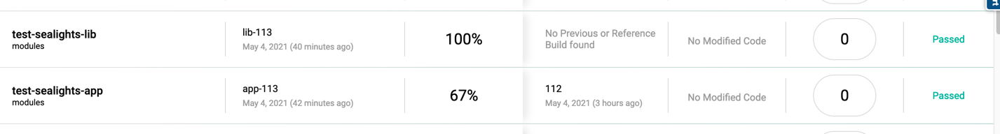

# Sealights - Multi project gradle builds

To create individual project level reports on dashboard follow these steps

1. Each module should have their own unique appName and build 

[lib/build.gradle](lib/build.gradle#L9)
```groovy
sealights {
    appName = 'test-sealights-lib'
    build = "lib-${System.getenv('CI_JOB_ID')}"
    // Other confs
}
```

[app/build.gradle](app/build.gradle#L17)
```
sealights {
    appName = 'test-sealights-app'
    build = "app-${System.getenv('CI_JOB_ID')}"
    // Other confs
}
```
2. Run gradle test job separately for each project
```shell
gradle ':lib:test' -Psealights
gradle ':app:test' -Psealights
```

Now you shoudl be able to see two Apps in sealights dashboard

